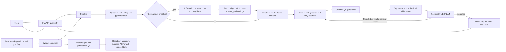

# SchemaDrill

SchemaDrill is a retrieval-augmented PostgreSQL text-to-SQL service. It embeds one DDL block per table into pgvector, retrieves the top three tables for a question, optionally expands one hop across foreign keys, sends the retrieved schema and question to Gemini, validates the generated SQL, and executes it with a bounded retry loop.

## Architecture

GitHub renders this Mermaid diagram directly in the README. It shows the request path, optional schema expansion, retry feedback, and the separate evaluation path.



See [docs/modules.md](docs/modules.md) for the module-by-module ownership map and [docs/implementation-notes.md](docs/implementation-notes.md) for the implementation decisions and troubleshooting history.

## Current v0 Status

The repository currently implements the v0 runtime end to end: Docker Compose, PostgreSQL/pgvector, local `bge-small-en-v1.5` retrieval, structured Gemini SQL generation, PostgreSQL parsing and `EXPLAIN` retries, read-only execution, row-cap handling, and Markdown result generation.

The evaluation harness distinguishes generated-query execution success, result-based Execution Accuracy (EX), AST similarity, result metadata, and SQL execution timing. Chinook is the fast deterministic regression dataset. BIRD Mini-Dev is an opt-in evaluation dataset and is not run on every push.

This is still a deliberately small v0 benchmark: the checked-in dataset is deterministic Chinook smoke data, not the planned multi-database Spider/BIRD subset. Database RBAC remains the final boundary; application-level SQL guard enforcement, result comparison, judge-model calls, caching, tracing, and frontend work are at different maturity levels and are documented separately.

## Run Locally

Prerequisites: Docker with Compose and a Gemini API key.

```sh
cp .env.example .env
# Put a Gemini Developer API key in GEMINI_API_KEY inside .env.
docker compose up -d --build
```

Wait until both services are healthy:

```sh
docker compose ps
curl http://localhost:8000/health
```

The first ingestion loads `BAAI/bge-small-en-v1.5` on CPU. Ingest the demo Chinook schema once after the database is ready:

```sh
docker compose exec app python -m ingest.schema_ingest chinook
```

The Compose database seed creates five deterministic Chinook cases with artists, albums, and tracks. To start from a clean database and reload the schema and rows:

```sh
docker compose down -v
docker compose up -d db
docker compose exec app python -m ingest.schema_ingest chinook
```

Open Swagger at <http://localhost:8000/docs> or call the API:

```sh
curl -X POST http://localhost:8000/query \
 -H 'Content-Type: application/json' \
 -d '{"db":"chinook","question":"List the names of all artists."}'
```

View retrieval similarity scores, the exact Gemini prompt, and generated SQL:

```sh
docker compose logs -f app
```

The API uses a read-only Postgres role. `sql_guard` is a deterministic defense-in-depth boundary before `EXPLAIN`: only single SELECT statements are allowed, physical tables are checked against the retrieved/RBAC scope, privileged PostgreSQL functions are blocked, and a configured maximum LIMIT is injected or enforced. PostgreSQL RBAC remains the final security boundary.

## Prompt Benchmark

Run every prompt sequentially through retrieval, Gemini, SQL validation, the offline parsed-SQL judge, and Postgres execution:

```sh
docker compose exec app python -m eval.run_benchmark \
 --questions eval/questions.json \
 --output /tmp/schemadrill-results.jsonl
```

The command prints each prompt result immediately and reports result-based Execution Accuracy, execution success, AST match rate, result metadata, and timing. AST match remains a diagnostic and is not used as EX. Run a smaller check with:

```sh
docker compose exec app python -m eval.run_benchmark --db chinook --limit 1
```

Each JSONL record includes `gold_sql`, `generated_sql`, canonical `result_match`, compatibility `execution_match`, separate `ast_match`, execution errors/categories, row counts, columns, and gold/generated SQL execution times. The result comparator preserves duplicate rows, handles NULL and numeric representations, ignores row order, and keeps column order significant. Aggregate output reports canonical `result_set_accuracy`, `execution_success_rate`, `ast_match_rate`, and `mean_elapsed_ms`, while retaining `execution_accuracy` as a compatibility alias.

Set `DISABLE_SELF_CORRECTION=true` to force the pipeline and benchmark runner to use exactly one generation/gate/execute attempt, regardless of `MAX_RETRIES`. The default `false` value preserves the configured retry budget. For local comparison artifacts, use `--disable-self-correction` with the benchmark runner and write separate outputs such as `results_retry.jsonl` and `results_noretry.jsonl`.
The live matrix script sets `ENABLE_FK_EXPANSION` and `DISABLE_SELF_CORRECTION` for each run. To measure resume metrics (this calls Gemini; it is separate from CI):

```sh
docker compose exec -T app python -m eval.run_benchmark_matrix \
  --questions eval/questions.json --db chinook \
  --output-dir /tmp/schemadrill-benchmark
docker compose cp app:/tmp/schemadrill-benchmark ./benchmark-results
```

The runner writes four raw files (`no_retry_no_fk.jsonl`, `retry_no_fk.jsonl`, `no_retry_fk.jsonl`, `retry_fk.jsonl`) and `matrix_summary.json`. It warms the embedding model outside the timed run and reports result-match counts, accuracy and paired deltas. Mean elapsed time includes query generation, execution and gold/generated SQL evaluation. Report the dataset and example count with resume metrics.

### Resume metrics status

The checked-in `results_noretry.jsonl` and `results_retry.jsonl` are controlled evaluator outputs: every `generated_sql` exactly equals `gold_sql`. They are not live Gemini measurements and must not be used as resume claims. No complete live four-configuration matrix is checked in. Use `eval.run_benchmark_matrix` to create fresh artifacts for the four configurations.

After the matrix run finishes, use its aggregate report to fill this table (latency in seconds for the resume bullet):

| Configuration | Result-set accuracy | Mean elapsed time |
| --- | ---: | ---: |
| No self-correction | Not measured | Not measured |
| With self-correction | Not measured | Not measured |
| No FK expansion | Not measured | Not measured |
| With FK expansion | Not measured | Not measured |

Do not infer an improvement unless the paired run artifacts show it; report the example count and dataset with the figures.

The legacy entry point delegates to the same runner:

```sh
docker compose exec app python -m eval.run_eval --questions eval/questions.json
```

## Dataset Evaluation

Use `evaluation/` for dataset-facing commands and cases. The older `eval/` package remains the implementation and backward-compatible CLI location.

Run the five deterministic Chinook cases locally after starting the database and ingesting the schema:

```sh
docker compose exec app python -m evaluation.runner \
 --questions evaluation/chinook/cases.json \
 --dataset chinook \
 --output /tmp/schemadrill-chinook.jsonl
```

Run the evaluator/database smoke check without Gemini:

```sh
docker compose run --rm app python -m evaluation.runner \
 --gold-as-generated --dataset chinook
```

This controlled check should report 100% EX and AST match for the seeded gold cases. It validates the evaluator and database fixture, not model quality. BIRD Mini-Dev belongs in a manual/nightly run once its local dataset and reference semantics are configured:

```sh
python -m evaluation.runner \
 --questions evaluation/bird/mini_dev.json \
 --dataset bird-mini-dev
```

## PostgreSQL

You do not need a remote PostgreSQL instance for local development. Compose starts `pgvector/pg16`, creates the `schemadrill` database, enables the vector extension, creates the HNSW-backed `schema_embeddings` table, and loads the demo `chinook` schema.

A remote instance such as Neon is optional for shared or deployed environments. Set both `DATABASE_URL` and `INGEST_DATABASE_URL` to that instance, enable the `vector` extension, run `scripts/init.sql`, create/load the target schemas, and run ingestion before calling `/query`.

## Local Checks and CI Reproduction

Run the quality job and Docker/Postgres job from `.github/workflows/ci.yml` locally:

```sh
source .venv/bin/activate
pip install -r requirements-dev.txt
ruff check .
black --check .
pytest -q
docker compose config -q
docker compose build app
docker compose up -d db
docker compose run --rm app python -m eval.benchmark
docker compose run --rm app python -m evaluation.runner --gold-as-generated --dataset chinook
docker compose up -d app
curl --fail http://localhost:8000/health
docker compose down
```

The evaluator smoke test uses gold SQL and does not call Gemini. `eval.benchmark` checks pgvector infrastructure; it is not the live SQL-quality benchmark. The four-run matrix above calls Gemini and is separate from CI. `docker compose down` stops the services while keeping the database volume.

### Run the four live benchmark configurations

Set `GEMINI_API_KEY` in `.env`, then start the database and app, ingest Chinook's schema so vector retrieval has DDL embeddings, and run the matrix:

```sh
docker compose up -d db app
docker compose exec app python -m ingest.schema_ingest chinook
docker compose exec -T app python -m eval.run_benchmark_matrix \
  --questions eval/questions.json --db chinook \
  --output-dir /tmp/schemadrill-benchmark
docker compose cp app:/tmp/schemadrill-benchmark ./benchmark-results
```

The script performs an untimed embedding-model warm-up for each configuration, then runs the same questions with retries off/on and FK expansion off/on. It writes `no_retry_no_fk.jsonl`, `retry_no_fk.jsonl`, `no_retry_fk.jsonl`, `retry_fk.jsonl`, and `matrix_summary.json`. The summary gives accuracy deltas in percentage points and mean elapsed-time deltas in milliseconds and seconds. Keep the four raw JSONL files with the summary for reproducibility; their elapsed time includes query generation, execution, and gold/generated SQL evaluation, but excludes embedding-model download and initialization.

## CI

GitHub Actions runs Ruff, Black, pytest, Docker Compose validation, Postgres/pgvector checks, the vector benchmark, and the credential-free Chinook evaluator smoke test. The smoke test validates EX, AST, and result execution against the seeded gold SQL without calling Gemini. BIRD Mini-Dev is intentionally excluded from push/PR CI and should run manually or nightly.
